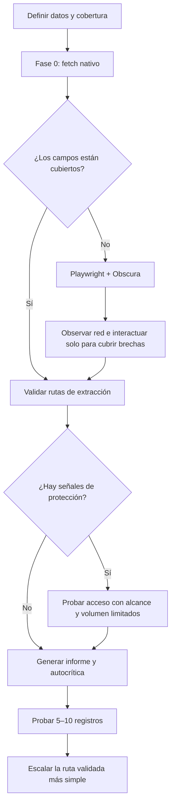

# Reconocimiento web basado en evidencia

Una habilidad metodológica para el reconocimiento y la extracción de sitios web basados en evidencia, con `fetch` nativo, Playwright y el entorno de navegador sin interfaz Obscura.

## Instalación

Instalar la skill desde GitHub:

```bash
npx skills add rrortega/web-scraper-skill --skill web-scraping
```

Usar `npx skills add --help` para seleccionar un agente, una instalación global u otras opciones de la CLI.

## Método

1. Definir los puntos de datos requeridos y el umbral de cobertura.
2. Usar `fetch` nativo para una evaluación económica de la Fase 0 del estado, encabezados, HTML sin procesar, JSON incrustado y archivos de descubrimiento.
3. Escalar únicamente los campos faltantes a Playwright respaldado por Obscura.
4. Observar un conjunto acotado de solicitudes y respuestas XHR/fetch sin conservar credenciales.
5. Validar cada selector, ruta JSON, endpoint y afirmación de paginación.
6. Probar protecciones solo cuando la evidencia o el alcance explícito lo exijan.
7. Devolver un informe de inteligencia con brechas, supuestos, riesgos de desactualización y autocrítica.
8. Implementar la ruta validada más simple y probar de 5 a 10 registros variados antes de escalar.



## Configuración de Obscura

Inicie Obscura en una terminal independiente:

```bash
obscura serve --port 9222
```

Conéctese desde Playwright:

```js
import { chromium } from 'playwright';

const browser = await chromium.connectOverCDP('ws://127.0.0.1:9222');
```

Use páginas, contextos, localizadores, eventos de solicitud/respuesta, enrutamiento, cookies, capturas de pantalla y PDF habituales de Playwright. `browser.close()` desconecta el cliente CDP; no detiene el servidor Obscura.

Obscura no proporciona video ni tracing nativos de Playwright. El guardado/restauración de estado de almacenamiento es limitado; use el directorio de almacenamiento de Obscura para persistencia. Los service workers, medios nativos, algunas API web, CSS de casos poco frecuentes y el comportamiento del compositor no son completamente compatibles. Varias páginas comparten un aislamiento V8. No presuponga características de antidetección ni de identidad de red que no estén documentadas.

## Contenido

- [`SKILL.md`](SKILL.md): contrato de ejecución compacto
- [`workflows/`](workflows/): guía de reconocimiento, implementación y operación
- [`strategies/`](strategies/): métodos centrados en decisiones y extracción
- [`reference/`](reference/): esquema de informe, observación segura, patrones y antipatrones
- [`examples/`](examples/): ejemplos ejecutables de JavaScript

Comience con [`workflows/reconnaissance.md`](workflows/reconnaissance.md). Los ejemplos y la configuración están indexados en [`examples/README.md`](examples/README.md).

## Licencia

La licencia principal de este repositorio es Apache-2.0. El material upstream adaptado conserva su aviso MIT en [LICENSES/upstream-web-scraping-MIT.txt](LICENSES/upstream-web-scraping-MIT.txt).

**Autor:** [Rolando Rodriguez Ortega](https://github.com/rrortega)
